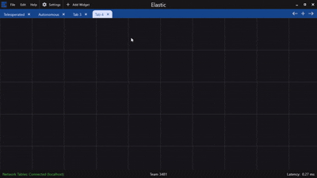

# Live Tuning

## What is Live Tuning?

Live tuning allows you to tune your closed loop controller and feedforward easily through NetworkTables using AdvantageScope or Elastic.

Live Tuning is enabled when any tunable setpoint is enabled with `TelemetryVerbosity.HIGH`

<pre class="language-java"><code class="lang-java">SmartMotorControllerConfig lowerFlyWheelConfig = new SmartMotorControllerConfig(this)
      .withControlMode(ControlMode.CLOSED_LOOP)
      .withIdleMode(MotorMode.COAST)
      .withGearing(new MechanismGearing(GearBox.fromReductionStages(3, 4)))
      .withMomentOfInertia(Inches.of(4), Pounds.of(2))
      .withClosedLoopController(1,
                                0,
                                0) // You generally do not want a profile because its not a position controlled loop.
      .withFeedforward(new SimpleMotorFeedforward(0, 0, 0)) // Helps track changing RPM goals
      .withMotorInverted(false)
<strong>      .withTelemetry("LowerFlyWheel", SmartMotorControllerConfig.TelemetryVerbosity.HIGH)
</strong></code></pre>

## How do I use Live Tuning?


Live Tuning can be **DANGEROUS** please test in sim before the real robot to understand the implications and dangers you will experience on the real robot!


To enable Live Tuning drag the `Live Tuning` command in from `NT:/SmartDashboard/MECHANISM_NAME/Commands/SUBSYSTEM_NAME/Live Tuning` with Elastic.

After ensuring the robot is enabled in you can press the button to enable Live Tuning!


The button will run the `Live Tuning` command which can be interrupted by the controller or any other triggers for that subsystem in your program!


<figure><figcaption></figcaption></figure>

Now you can tune your mechanism while your robot is enabled!

<figure><figcaption></figcaption></figure>

## When should I NOT use Live Tuning?

You should not use Live Tuning if you have not tested it in sim yet. It is ALWAYS better to know what you're getting yourself into!

## Tunable Parameters and Their Units

When live tuning, it's important to understand what units each parameter expects. Below is a comprehensive reference for all tunable values.

### PID Controller Parameters

| Parameter | Symbol | Unit | Description |
|-----------|--------|------|-------------|
| Proportional Gain | kP | Volts per Rotation (V/rot) | Output voltage per unit of position error. For linear mechanisms, this is V/m. |
| Integral Gain | kI | Volts per Rotation-Second (V/(rot·s)) | Output voltage per accumulated position error over time. For linear mechanisms, this is V/(m·s). |
| Derivative Gain | kD | Volts per Rotation/Second (V/(rot/s)) | Output voltage per unit of velocity error. For linear mechanisms, this is V/(m/s). |


**Position Control**: Error is measured in **Rotations** (mechanism output shaft) or **Meters** (for linear mechanisms with linear closed loop controllers set).

**Velocity Control**: Error is measured in **Rotations per Second** or **Meters per Second**.


### Feedforward Parameters

#### SimpleMotorFeedforward (Flywheels, Simple Velocity Control)

| Parameter | Symbol | Unit | Description |
|-----------|--------|------|-------------|
| Static Gain | kS | Volts (V) | Voltage to overcome static friction. Applied in the direction of motion. |
| Velocity Gain | kV | Volts per Rotation/Second (V/(rot/s)) | Voltage per unit of target velocity. |
| Acceleration Gain | kA | Volts per Rotation/Second² (V/(rot/s²)) | Voltage per unit of target acceleration. |

#### ArmFeedforward (Arms, Pivots)

| Parameter | Symbol | Unit | Description |
|-----------|--------|------|-------------|
| Static Gain | kS | Volts (V) | Voltage to overcome static friction. |
| Gravity Gain | kG | Volts (V) | Voltage to hold the arm horizontal (at 0°). Actual output is `kG * cos(angle)`. |
| Velocity Gain | kV | Volts per Rotation/Second (V/(rot/s)) | Voltage per unit of target angular velocity. |
| Acceleration Gain | kA | Volts per Rotation/Second² (V/(rot/s²)) | Voltage per unit of target angular acceleration. |


In YAMS, `ArmFeedforward` uses **Rotations** for kV and kA units, consistent with other feedforward types. The cosine calculation for gravity compensation is handled internally.


#### ElevatorFeedforward (Elevators, Linear Lifts)

| Parameter | Symbol | Unit | Description |
|-----------|--------|------|-------------|
| Static Gain | kS | Volts (V) | Voltage to overcome static friction. |
| Gravity Gain | kG | Volts (V) | Constant voltage to counteract gravity. Applied continuously when moving up or holding position. |
| Velocity Gain | kV | Volts per Meter/Second (V/(m/s)) | Voltage per unit of target velocity. |
| Acceleration Gain | kA | Volts per Meter/Second² (V/(m/s²)) | Voltage per unit of target acceleration. |

### Motion Profile Parameters

#### Trapezoidal Profile

| Parameter | Symbol | Unit | Description |
|-----------|--------|------|-------------|
| Max Velocity | maxV | Rotations per Second (rot/s) | Maximum velocity during the cruise phase. For linear: Meters per Second (m/s). |
| Max Acceleration | maxA | Rotations per Second² (rot/s²) | Acceleration/deceleration rate. For linear: Meters per Second² (m/s²). |

#### Exponential Profile

| Parameter | Symbol | Unit | Description |
|-----------|--------|------|-------------|
| Max Input Voltage | V | Volts (V) | Maximum voltage the profile will command. |
| kV | kV | Volts per Rotation/Second (V/(rot/s)) | System velocity constant from motor characterization. |
| kA | kA | Volts per Rotation/Second² (V/(rot/s²)) | System acceleration constant from motor characterization. |

### Soft Limits

| Parameter | Unit | Description |
|-----------|------|-------------|
| Lower Limit | Rotations (rot) or Meters (m) | Minimum allowed mechanism position. |
| Upper Limit | Rotations (rot) or Meters (m) | Maximum allowed mechanism position. |
| Closed Loop Tolerance | Rotations (rot) or Meters (m) | Position error threshold for "at goal" detection. |

### Current Limits

| Parameter | Unit | Description |
|-----------|------|-------------|
| Stator Current Limit | Amps (A) | Maximum current through the motor windings. Controls torque output. |
| Supply Current Limit | Amps (A) | Maximum current drawn from the battery. Prevents brownouts. |

### Ramp Rates

| Parameter | Unit | Description |
|-----------|------|-------------|
| Open Loop Ramp Rate | Seconds (s) | Time to ramp from 0% to 100% output in open loop mode. |
| Closed Loop Ramp Rate | Seconds (s) | Time to ramp from 0% to 100% output in closed loop mode. |

### Temperature

| Parameter | Unit | Description |
|-----------|------|-------------|
| Temperature Cutoff | Celsius (°C) | Motor controller will stop if temperature exceeds this value. |

### Voltage

| Parameter | Unit | Description |
|-----------|------|-------------|
| Voltage Compensation | Volts (V) | Nominal voltage for consistent behavior regardless of battery voltage. Typically 12V. |
| Closed Loop Max Voltage | Volts (V) | Maximum voltage output from the closed loop controller. |

## Example: Tuning a Flywheel

When tuning a flywheel with `SimpleMotorFeedforward`:

1. **Start with kS**: Slowly increase until the wheel just barely starts moving
2. **Tune kV**: Set a target velocity, then adjust kV until the steady-state velocity matches (with kP = 0)
3. **Add kP**: Increase proportional gain to reduce steady-state error and improve response time
4. **Fine-tune kD**: If there's oscillation, add derivative gain to dampen it
5. **Add kA** (optional): If you need faster acceleration response, tune the acceleration feedforward


**Units Example**: If your flywheel has a kV of 0.12 V/(rot/s), that means 0.12 volts are needed for every rotation per second of velocity. At 100 rot/s (6000 RPM), the feedforward would contribute 12V.


## Example: Tuning an Arm

When tuning an arm with `ArmFeedforward`:

1. **Find kG**: Hold the arm horizontal (90° from vertical or 0° from horizontal depending on your coordinate system) and increase kG until it holds position
2. **Set kV and kA**: These come from SysId characterization
3. **Tune kP**: Increase until position tracking is responsive but not oscillating
4. **Add kD**: Dampen any oscillations


Remember that `kG * cos(angle)` is applied, so at vertical (±90° from horizontal), no gravity compensation is applied, and at horizontal (0°), full kG is applied.

