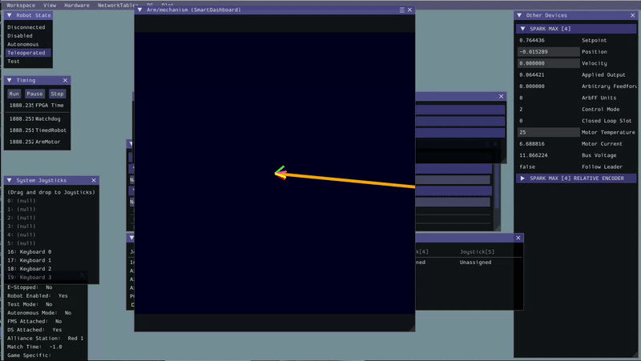
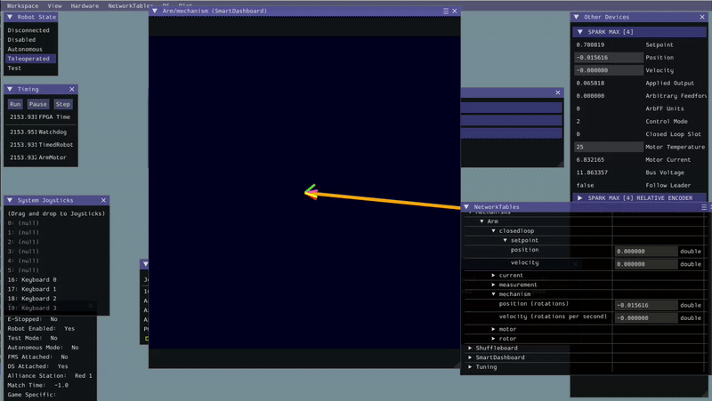

# Arm


Mechanism classes are meant to be used with "tightly coupled" mechanisms where the Mechanism has 1 or more motor controlling it on a connected shaft, gearbox, or other linkage.&#x20;

**IF** your mechanism is "loosely coupled", you **CAN** still use YAMS. **HOWEVER** you have to create and control the `SmartMotorController` directly as shown in [how-do-i-control-a-mechanism-without-a-mechanism-class.md](../how-to/how-do-i-control-a-mechanism-without-a-mechanism-class.md "mention") OR use `SmartMotorControllerConfig.withLooselyCoupledFollowers(SmartMotorController...)`


## Intro

At the end of this tutorial you will have an `Arm` that will work in both real life and simulation with the same code!



### Simulation

<figure><figcaption></figcaption></figure>



### Real Life





## Details

This `Arm` will be using the following hardware specs and control details

* `SparkMax` controlling the `Arm`
* `12:1` GearBox on the `Arm`
* Pressing `A` will make the `Arm` go to -5deg
* Pressing `B` will make the `Arm` go to 15deg
* Pressing `X` will make the `Arm` go up.
* Pressing `Y` will make the `Arm` go down.

## Lets create a WPILib Command-Based Project!


IF you already have a project and know how to place the `Arm` mechanism into your own subsystem please skip to [#install-yams](arm.md#install-yams "mention")


### Setup our Command-Based Project

Here we will follow [WPILib's tutorial ](https://docs.wpilib.org/en/stable/docs/zero-to-robot/step-4/creating-test-drivetrain-program-cpp-java-python.html)on how to create a Command-Based project.

Bring up the Visual Studio Code command palette with <kbd>Ctrl+Shift+P</kbd>. Then, type “WPILib” into the prompt. Since all WPILib commands start with “WPILib”, this will bring up the list of WPILib-specific VS Code commands. Now, select the “Create a new project” command:

<figure><figcaption></figcaption></figure>

This will bring up the “New Project Creator Window:”

<figure><figcaption></figcaption></figure>

1. Click on **Select a project type (Example or Template)**
2. Select **Template** then **Java** then **Command Robot**
3. Click on **Select a new project folder** and select a folder to store your robot project in.
4. Fill in **Project Name** with the name of your robot code project.
5. Enter your **Team Number** in so you can deploy to your robot.
6. Be sure to check **Enable Desktop Support** so we can run simulations!

If you followed these instructions it should look something like whats filled out below.

<figure><figcaption></figcaption></figure>

Congratulations! You now have a Command Based robot project!

<figure><figcaption></figcaption></figure>

### Install YAMS!

Click on the **WPILib logo** on the **left** pane. Scroll down to **Yet Another Mechanism System** and click **Install**!

<figure><figcaption></figcaption></figure>

Congratulations you have now installed YAMS! :tada:

## Lets make an Arm move!



### Create a `SmartMotorControllerConfig`

We are going to start by configuring out motor controller.

<pre class="language-java" data-title="ExampleSubsystem.java" data-line-numbers data-full-width="true"><code class="lang-java">// Copyright (c) FIRST and other WPILib contributors.
// Open Source Software; you can modify and/or share it under the terms of
// the WPILib BSD license file in the root directory of this project.

package frc.robot.subsystems;

<strong>import static edu.wpi.first.units.Units.Amps;
</strong><strong>import static edu.wpi.first.units.Units.DegreesPerSecond;
</strong><strong>import static edu.wpi.first.units.Units.DegreesPerSecondPerSecond;
</strong><strong>import static edu.wpi.first.units.Units.Seconds;
</strong>
<strong>import edu.wpi.first.math.controller.ArmFeedforward;
</strong>import edu.wpi.first.wpilibj2.command.Command;
import edu.wpi.first.wpilibj2.command.SubsystemBase;
<strong>import yams.mechanisms.SmartMechanism;
</strong><strong>import yams.motorcontrollers.SmartMotorControllerConfig;
</strong><strong>import yams.motorcontrollers.SmartMotorControllerConfig.ControlMode;
</strong><strong>import yams.motorcontrollers.SmartMotorControllerConfig.MotorMode;
</strong><strong>import yams.motorcontrollers.SmartMotorControllerConfig.TelemetryVerbosity;
</strong>
public class ExampleSubsystem extends SubsystemBase {

<strong>  private SmartMotorControllerConfig smcConfig = new SmartMotorControllerConfig(this)
</strong><strong>  .withControlMode(ControlMode.CLOSED_LOOP)
</strong><strong>  // Feedback Constants (PID Constants)
</strong><strong>  .withClosedLoopController(50, 0, 0, DegreesPerSecond.of(90), DegreesPerSecondPerSecond.of(45))
</strong><strong>  .withSimClosedLoopController(50, 0, 0, DegreesPerSecond.of(90), DegreesPerSecondPerSecond.of(45))
</strong><strong>  // Feedforward Constants
</strong><strong>  .withFeedforward(new ArmFeedforward(0, 0, 0))
</strong><strong>  .withSimFeedforward(new ArmFeedforward(0, 0, 0))
</strong><strong>  // Telemetry name and verbosity level
</strong><strong>  .withTelemetry("ArmMotor", TelemetryVerbosity.HIGH)
</strong><strong>  // Gearing from the motor rotor to final shaft.
</strong><strong>  // In this example GearBox.fromReductionStages(3,4) is the same as GearBox.fromStages("3:1","4:1") which corresponds to the gearbox attached to your motor.
</strong><strong>  // You could also use .withGearing(12) which does the same thing.
</strong><strong>  .withGearing(new MechanismGearing(GearBox.fromReductionStages(3, 4)))
</strong><strong>  // Motor properties to prevent over currenting.
</strong><strong>  .withMotorInverted(false)
</strong><strong>  .withIdleMode(MotorMode.BRAKE)
</strong><strong>  .withStatorCurrentLimit(Amps.of(40))
</strong><strong>  .withClosedLoopRampRate(Seconds.of(0.25))
</strong><strong>  .withOpenLoopRampRate(Seconds.of(0.25));
</strong>
  /** Creates a new ExampleSubsystem. */
  public ExampleSubsystem() {}

  /**
   * Example command factory method.
   *
   * @return a command
   */
  public Command exampleMethodCommand() {
    // Inline construction of command goes here.
    // Subsystem::RunOnce implicitly requires `this` subsystem.
    return runOnce(
        () -> {
          /* one-time action goes here */
        });
  }

  /**
   * An example method querying a boolean state of the subsystem (for example, a digital sensor).
   *
   * @return value of some boolean subsystem state, such as a digital sensor.
   */
  public boolean exampleCondition() {
    // Query some boolean state, such as a digital sensor.
    return false;
  }

  @Override
  public void periodic() {
    // This method will be called once per scheduler run
  }

  @Override
  public void simulationPeriodic() {
    // This method will be called once per scheduler run during simulation
  }
}

</code></pre>



### Create our motor controller

To control our `Arm` motor we will create the vendor motor controller object.

First we install `REVLib` by clicking on the WPILib logo in the left bar.

<figure><figcaption></figcaption></figure>

Now we add it to the `ExampleSubsystem.java`

<pre class="language-java" data-title="ExampleSubsystem.java" data-line-numbers><code class="lang-java">// Copyright (c) FIRST and other WPILib contributors.
// Open Source Software; you can modify and/or share it under the terms of
// the WPILib BSD license file in the root directory of this project.

package frc.robot.subsystems;

import static edu.wpi.first.units.Units.Amps;
import static edu.wpi.first.units.Units.Degrees;
import static edu.wpi.first.units.Units.DegreesPerSecond;
import static edu.wpi.first.units.Units.DegreesPerSecondPerSecond;
import static edu.wpi.first.units.Units.Seconds;

<strong>import com.revrobotics.spark.SparkLowLevel.MotorType;
</strong><strong>import com.revrobotics.spark.SparkMax;
</strong>
import edu.wpi.first.math.controller.ArmFeedforward;
import edu.wpi.first.wpilibj2.command.Command;
import edu.wpi.first.wpilibj2.command.SubsystemBase;
import yams.mechanisms.SmartMechanism;
import yams.motorcontrollers.SmartMotorControllerConfig;
import yams.motorcontrollers.SmartMotorControllerConfig.ControlMode;
import yams.motorcontrollers.SmartMotorControllerConfig.MotorMode;
import yams.motorcontrollers.SmartMotorControllerConfig.TelemetryVerbosity;

public class ExampleSubsystem extends SubsystemBase {

  private SmartMotorControllerConfig smcConfig = new SmartMotorControllerConfig(this)
  .withControlMode(ControlMode.CLOSED_LOOP)
  // Feedback Constants (PID Constants)
  .withClosedLoopController(50, 0, 0, DegreesPerSecond.of(90), DegreesPerSecondPerSecond.of(45))
  .withSimClosedLoopController(50, 0, 0, DegreesPerSecond.of(90), DegreesPerSecondPerSecond.of(45))
  // Feedforward Constants
  .withFeedforward(new ArmFeedforward(0, 0, 0))
  .withSimFeedforward(new ArmFeedforward(0, 0, 0))
  // Telemetry name and verbosity level
  .withTelemetry("ArmMotor", TelemetryVerbosity.HIGH)
  // Gearing from the motor rotor to final shaft.
  // In this example GearBox.fromReductionStages(3,4) is the same as GearBox.fromStages("3:1","4:1") which corresponds to the gearbox attached to your motor.
  .withGearing(new MechanismGearing(GearBox.fromReductionStages(3, 4)))
  // Motor properties to prevent over currenting.
  .withMotorInverted(false)
  .withIdleMode(MotorMode.BRAKE)
  .withStatorCurrentLimit(Amps.of(40))
  .withClosedLoopRampRate(Seconds.of(0.25))
  .withOpenLoopRampRate(Seconds.of(0.25));

<strong>  // Vendor motor controller object
</strong><strong>  private SparkMax spark = new SparkMax(4, MotorType.kBrushless);
</strong>

  /** Creates a new ExampleSubsystem. */
  public ExampleSubsystem() {}

  /**
   * Example command factory method.
   *
   * @return a command
   */
  public Command exampleMethodCommand() {
    // Inline construction of command goes here.
    // Subsystem::RunOnce implicitly requires `this` subsystem.
    return runOnce(
        () -> {
          /* one-time action goes here */
        });
  }

  /**
   * An example method querying a boolean state of the subsystem (for example, a digital sensor).
   *
   * @return value of some boolean subsystem state, such as a digital sensor.
   */
  public boolean exampleCondition() {
    // Query some boolean state, such as a digital sensor.
    return false;
  }

  @Override
  public void periodic() {
    // This method will be called once per scheduler run
  }

  @Override
  public void simulationPeriodic() {
    // This method will be called once per scheduler run during simulation
  }
}
</code></pre>



### Create our `SmartMotorController`

Our `SmartMotorController` will easily configure and interface with the vendor motor controller object.

<pre class="language-java" data-title="ExampleSubsystem.java" data-line-numbers><code class="lang-java">// Copyright (c) FIRST and other WPILib contributors.
// Open Source Software; you can modify and/or share it under the terms of
// the WPILib BSD license file in the root directory of this project.

package frc.robot.subsystems;

import static edu.wpi.first.units.Units.Amps;
import static edu.wpi.first.units.Units.Degrees;
import static edu.wpi.first.units.Units.DegreesPerSecond;
import static edu.wpi.first.units.Units.DegreesPerSecondPerSecond;
import static edu.wpi.first.units.Units.Seconds;

import com.revrobotics.spark.SparkLowLevel.MotorType;
import com.revrobotics.spark.SparkMax;

import edu.wpi.first.math.controller.ArmFeedforward;
<strong>import edu.wpi.first.math.system.plant.DCMotor;
</strong>import edu.wpi.first.wpilibj2.command.Command;
import edu.wpi.first.wpilibj2.command.SubsystemBase;
import yams.mechanisms.SmartMechanism;
<strong>import yams.motorcontrollers.SmartMotorController;
</strong>import yams.motorcontrollers.SmartMotorControllerConfig;
import yams.motorcontrollers.SmartMotorControllerConfig.ControlMode;
import yams.motorcontrollers.SmartMotorControllerConfig.MotorMode;
import yams.motorcontrollers.SmartMotorControllerConfig.TelemetryVerbosity;
<strong>import yams.motorcontrollers.local.SparkWrapper;
</strong>
public class ExampleSubsystem extends SubsystemBase {

  private SmartMotorControllerConfig smcConfig = new SmartMotorControllerConfig(this)
  .withControlMode(ControlMode.CLOSED_LOOP)
  // Feedback Constants (PID Constants)
  .withClosedLoopController(50, 0, 0, DegreesPerSecond.of(90), DegreesPerSecondPerSecond.of(45))
  .withSimClosedLoopController(50, 0, 0, DegreesPerSecond.of(90), DegreesPerSecondPerSecond.of(45))
  // Feedforward Constants
  .withFeedforward(new ArmFeedforward(0, 0, 0))
  .withSimFeedforward(new ArmFeedforward(0, 0, 0))
  // Telemetry name and verbosity level
  .withTelemetry("ArmMotor", TelemetryVerbosity.HIGH)
  // Gearing from the motor rotor to final shaft.
  // In this example GearBox.fromReductionStages(3,4) is the same as GearBox.fromStages("3:1","4:1") which corresponds to the gearbox attached to your motor.
  .withGearing(new MechanismGearing(GearBox.fromReductionStages(3, 4)))
  // Motor properties to prevent over currenting.
  .withMotorInverted(false)
  .withIdleMode(MotorMode.BRAKE)
  .withStatorCurrentLimit(Amps.of(40))
  .withClosedLoopRampRate(Seconds.of(0.25))
  .withOpenLoopRampRate(Seconds.of(0.25));

  // Vendor motor controller object
  private SparkMax spark = new SparkMax(4, MotorType.kBrushless);

<strong>  // Create our SmartMotorController from our Spark and config with the NEO.
</strong><strong>  private SmartMotorController sparkSmartMotorController = new SparkWrapper(spark, DCMotor.getNEO(1), smcConfig);
</strong>
  /** Creates a new ExampleSubsystem. */
  public ExampleSubsystem() {}

  /**
   * Example command factory method.
   *
   * @return a command
   */
  public Command exampleMethodCommand() {
    // Inline construction of command goes here.
    // Subsystem::RunOnce implicitly requires `this` subsystem.
    return runOnce(
        () -> {
          /* one-time action goes here */
        });
  }

  /**
   * An example method querying a boolean state of the subsystem (for example, a digital sensor).
   *
   * @return value of some boolean subsystem state, such as a digital sensor.
   */
  public boolean exampleCondition() {
    // Query some boolean state, such as a digital sensor.
    return false;
  }

  @Override
  public void periodic() {
    // This method will be called once per scheduler run
  }

  @Override
  public void simulationPeriodic() {
    // This method will be called once per scheduler run during simulation
  }
}

</code></pre>



### Create and Configure our `Arm`

Our `Arm` will easily configure the `SmartMotorController` and create a simple and intuitive interface.

<pre class="language-java" data-title="ExampleSubsystem.java" data-line-numbers><code class="lang-java">// Copyright (c) FIRST and other WPILib contributors.
// Open Source Software; you can modify and/or share it under the terms of
// the WPILib BSD license file in the root directory of this project.

package frc.robot.subsystems;

import static edu.wpi.first.units.Units.Amps;
import static edu.wpi.first.units.Units.Degrees;
import static edu.wpi.first.units.Units.DegreesPerSecond;
import static edu.wpi.first.units.Units.DegreesPerSecondPerSecond;
<strong>import static edu.wpi.first.units.Units.Feet;
</strong><strong>import static edu.wpi.first.units.Units.Pounds;
</strong>import static edu.wpi.first.units.Units.Seconds;

import com.revrobotics.spark.SparkLowLevel.MotorType;
import com.revrobotics.spark.SparkMax;

import edu.wpi.first.math.controller.ArmFeedforward;
import edu.wpi.first.math.system.plant.DCMotor;
import edu.wpi.first.wpilibj2.command.Command;
import edu.wpi.first.wpilibj2.command.SubsystemBase;
import yams.mechanisms.SmartMechanism;
<strong>import yams.mechanisms.config.ArmConfig;
</strong><strong>import yams.mechanisms.positional.Arm;
</strong>import yams.motorcontrollers.SmartMotorController;
import yams.motorcontrollers.SmartMotorControllerConfig;
import yams.motorcontrollers.SmartMotorControllerConfig.ControlMode;
import yams.motorcontrollers.SmartMotorControllerConfig.MotorMode;
import yams.motorcontrollers.SmartMotorControllerConfig.TelemetryVerbosity;
import yams.motorcontrollers.local.SparkWrapper;

public class ExampleSubsystem extends SubsystemBase {

  private SmartMotorControllerConfig smcConfig = new SmartMotorControllerConfig(this)
  .withControlMode(ControlMode.CLOSED_LOOP)
  // Feedback Constants (PID Constants)
  .withClosedLoopController(50, 0, 0, DegreesPerSecond.of(90), DegreesPerSecondPerSecond.of(45))
  .withSimClosedLoopController(50, 0, 0, DegreesPerSecond.of(90), DegreesPerSecondPerSecond.of(45))
  // Feedforward Constants
  .withFeedforward(new ArmFeedforward(0, 0, 0))
  .withSimFeedforward(new ArmFeedforward(0, 0, 0))
  // Telemetry name and verbosity level
  .withTelemetry("ArmMotor", TelemetryVerbosity.HIGH)
  // Gearing from the motor rotor to final shaft.
  // In this example GearBox.fromReductionStages(3,4) is the same as GearBox.fromStages("3:1","4:1") which corresponds to the gearbox attached to your motor.
  .withGearing(new MechanismGearing(GearBox.fromReductionStages(3, 4)))
  // Motor properties to prevent over currenting.
  .withMotorInverted(false)
  .withIdleMode(MotorMode.BRAKE)
  .withStatorCurrentLimit(Amps.of(40))
  .withClosedLoopRampRate(Seconds.of(0.25))
  .withOpenLoopRampRate(Seconds.of(0.25));

  // Vendor motor controller object
  private SparkMax spark = new SparkMax(4, MotorType.kBrushless);

  // Create our SmartMotorController from our Spark and config with the NEO.
  private SmartMotorController sparkSmartMotorController = new SparkWrapper(spark, DCMotor.getNEO(1), smcConfig);

<strong>  private ArmConfig armCfg = new ArmConfig(sparkSmartMotorController)
</strong><strong>  // Soft limit is applied to the SmartMotorControllers PID
</strong><strong>  .withSoftLimits(Degrees.of(-20), Degrees.of(10))
</strong><strong>  // Hard limit is applied to the simulation.
</strong><strong>  .withHardLimit(Degrees.of(-30), Degrees.of(40))
</strong><strong>  // Starting position is where your arm starts
</strong><strong>  .withStartingPosition(Degrees.of(-5))
</strong><strong>  // Length and mass of your arm for sim.
</strong><strong>  .withLength(Feet.of(3))
</strong><strong>  .withMass(Pounds.of(1))
</strong><strong>  // Telemetry name and verbosity for the arm.
</strong><strong>  .withTelemetry("Arm", TelemetryVerbosity.HIGH);
</strong>
<strong>  // Arm Mechanism
</strong><strong>  private Arm arm = new Arm(armCfg);
</strong>
  /** Creates a new ExampleSubsystem. */
  public ExampleSubsystem() {}

  /**
   * Example command factory method.
   *
   * @return a command
   */
  public Command exampleMethodCommand() {
    // Inline construction of command goes here.
    // Subsystem::RunOnce implicitly requires `this` subsystem.
    return runOnce(
        () -> {
          /* one-time action goes here */
        });
  }

  /**
   * An example method querying a boolean state of the subsystem (for example, a digital sensor).
   *
   * @return value of some boolean subsystem state, such as a digital sensor.
   */
  public boolean exampleCondition() {
    // Query some boolean state, such as a digital sensor.
    return false;
  }

  @Override
  public void periodic() {
<strong>    // This method will be called once per scheduler run
</strong><strong>    arm.updateTelemetry();
</strong>  }

  @Override
  public void simulationPeriodic() {
<strong>    // This method will be called once per scheduler run during simulation
</strong><strong>    arm.simIterate();
</strong>  }
}
</code></pre>



### Create `Command`s with our `Arm`

We use the `Arm` class as a interface to create commands!

<pre class="language-java" data-title="ExampleSubsystem.java" data-line-numbers><code class="lang-java">// Copyright (c) FIRST and other WPILib contributors.
// Open Source Software; you can modify and/or share it under the terms of
// the WPILib BSD license file in the root directory of this project.

package frc.robot.subsystems;

import static edu.wpi.first.units.Units.Amps;
import static edu.wpi.first.units.Units.Degrees;
import static edu.wpi.first.units.Units.DegreesPerSecond;
import static edu.wpi.first.units.Units.DegreesPerSecondPerSecond;
import static edu.wpi.first.units.Units.Feet;
import static edu.wpi.first.units.Units.Pounds;
<strong>import static edu.wpi.first.units.Units.Second;
</strong><strong>import static edu.wpi.first.units.Units.Seconds;
</strong><strong>import static edu.wpi.first.units.Units.Volts;
</strong>
import com.revrobotics.spark.SparkLowLevel.MotorType;
import com.revrobotics.spark.SparkMax;

import edu.wpi.first.math.controller.ArmFeedforward;
import edu.wpi.first.math.system.plant.DCMotor;
<strong>import edu.wpi.first.units.measure.Angle;
</strong>import edu.wpi.first.wpilibj2.command.Command;
import edu.wpi.first.wpilibj2.command.SubsystemBase;
import yams.mechanisms.SmartMechanism;
import yams.mechanisms.config.ArmConfig;
import yams.mechanisms.positional.Arm;
import yams.motorcontrollers.SmartMotorController;
import yams.motorcontrollers.SmartMotorControllerConfig;
import yams.motorcontrollers.SmartMotorControllerConfig.ControlMode;
import yams.motorcontrollers.SmartMotorControllerConfig.MotorMode;
import yams.motorcontrollers.SmartMotorControllerConfig.TelemetryVerbosity;
import yams.motorcontrollers.local.SparkWrapper;

public class ExampleSubsystem extends SubsystemBase {

  private SmartMotorControllerConfig smcConfig = new SmartMotorControllerConfig(this)
  .withControlMode(ControlMode.CLOSED_LOOP)
  // Feedback Constants (PID Constants)
  .withClosedLoopController(50, 0, 0, DegreesPerSecond.of(90), DegreesPerSecondPerSecond.of(45))
  .withSimClosedLoopController(50, 0, 0, DegreesPerSecond.of(90), DegreesPerSecondPerSecond.of(45))
  // Feedforward Constants
  .withFeedforward(new ArmFeedforward(0, 0, 0))
  .withSimFeedforward(new ArmFeedforward(0, 0, 0))
  // Telemetry name and verbosity level
  .withTelemetry("ArmMotor", TelemetryVerbosity.HIGH)
  // Gearing from the motor rotor to final shaft.
  // In this example GearBox.fromReductionStages(3,4) is the same as GearBox.fromStages("3:1","4:1") which corresponds to the gearbox attached to your motor.
  .withGearing(new MechanismGearing(GearBox.fromReductionStages(3, 4)))
  // Motor properties to prevent over currenting.
  .withMotorInverted(false)
  .withIdleMode(MotorMode.BRAKE)
  .withStatorCurrentLimit(Amps.of(40))
  .withClosedLoopRampRate(Seconds.of(0.25))
  .withOpenLoopRampRate(Seconds.of(0.25));

  // Vendor motor controller object
  private SparkMax spark = new SparkMax(4, MotorType.kBrushless);

  // Create our SmartMotorController from our Spark and config with the NEO.
  private SmartMotorController sparkSmartMotorController = new SparkWrapper(spark, DCMotor.getNEO(1), smcConfig);

  private ArmConfig armCfg = new ArmConfig(sparkSmartMotorController)
  // Soft limit is applied to the SmartMotorControllers PID
  .withSoftLimits(Degrees.of(-20), Degrees.of(10))
  // Hard limit is applied to the simulation.
  .withHardLimit(Degrees.of(-30), Degrees.of(40))
  // Starting position is where your arm starts
  .withStartingPosition(Degrees.of(-5))
  // Length and mass of your arm for sim.
  .withLength(Feet.of(3))
  .withMass(Pounds.of(1))
  // Telemetry name and verbosity for the arm.
  .withTelemetry("Arm", TelemetryVerbosity.HIGH);

  // Arm Mechanism
  private Arm arm = new Arm(armCfg);

<strong>  /**
</strong><strong>   * Set the angle of the arm, does not stop when the arm reaches the setpoint.
</strong><strong>   * @param angle Angle to go to.
</strong><strong>   * @return A command.
</strong><strong>   */
</strong><strong>  public Command setAngle(Angle angle) { return arm.run(angle);}
</strong>  
<strong>  /**
</strong><strong>   * Set the angle of the arm, ends the command but does not stop the arm when the arm reaches the setpoint.
</strong><strong>   * @param angle Angle to go to.
</strong><strong>   * @return A Command
</strong><strong>   */
</strong><strong>  public Command setAngleAndStop(Angle angle) { return arm.runTo(angle);}
</strong>  
<strong>  /**
</strong><strong>   * Set arm closed loop controller to go to the specified mechanism position.
</strong><strong>   * @param angle Angle to go to.
</strong><strong>   */
</strong><strong>  public void setAngleSetpoint(Angle angle) { arm.setMechanismPosition(angle); }
</strong>
<strong>  /**
</strong><strong>   * Move the arm up and down.
</strong><strong>   * @param dutycycle [-1, 1] speed to set the arm too.
</strong><strong>   */
</strong><strong>  public Command set(double dutycycle) { return arm.set(dutycycle);}
</strong>
<strong>  /**
</strong><strong>   * Run sysId on the {@link Arm}
</strong><strong>   */
</strong><strong>  public Command sysId() { return arm.sysId(Volts.of(7), Volts.of(2).per(Second), Seconds.of(4));}
</strong>
  /** Creates a new ExampleSubsystem. */
  public ExampleSubsystem() {}

  /**
   * Example command factory method.
   *
   * @return a command
   */
  public Command exampleMethodCommand() {
    // Inline construction of command goes here.
    // Subsystem::RunOnce implicitly requires `this` subsystem.
    return runOnce(
        () -> {
          /* one-time action goes here */
        });
  }

  /**
   * An example method querying a boolean state of the subsystem (for example, a digital sensor).
   *
   * @return value of some boolean subsystem state, such as a digital sensor.
   */
  public boolean exampleCondition() {
    // Query some boolean state, such as a digital sensor.
    return false;
  }

  @Override
  public void periodic() {
    // This method will be called once per scheduler run
    arm.updateTelemetry();
  }

  @Override
  public void simulationPeriodic() {
    // This method will be called once per scheduler run during simulation
    arm.simIterate();
  }
}

</code></pre>



### Bind buttons to our `Arm`

We bind buttons to use the `Commands` from our `Arm`

<pre class="language-java" data-title="RobotContainer.java" data-line-numbers><code class="lang-java">// Copyright (c) FIRST and other WPILib contributors.
// Open Source Software; you can modify and/or share it under the terms of
// the WPILib BSD license file in the root directory of this project.

package frc.robot;

import frc.robot.Constants.OperatorConstants;
import frc.robot.commands.Autos;
import frc.robot.commands.ExampleCommand;
import frc.robot.subsystems.ExampleSubsystem;

<strong>import static edu.wpi.first.units.Units.Degrees;
</strong>
import edu.wpi.first.wpilibj2.command.Command;
import edu.wpi.first.wpilibj2.command.button.CommandXboxController;
import edu.wpi.first.wpilibj2.command.button.Trigger;

/**
 * This class is where the bulk of the robot should be declared. Since Command-based is a
 * "declarative" paradigm, very little robot logic should actually be handled in the {@link Robot}
 * periodic methods (other than the scheduler calls). Instead, the structure of the robot (including
 * subsystems, commands, and trigger mappings) should be declared here.
 */
public class RobotContainer {
  // The robot's subsystems and commands are defined here...
  private final ExampleSubsystem m_exampleSubsystem = new ExampleSubsystem();

  // Replace with CommandPS4Controller or CommandJoystick if needed
  private final CommandXboxController m_driverController =
      new CommandXboxController(OperatorConstants.kDriverControllerPort);

  /** The container for the robot. Contains subsystems, OI devices, and commands. */
  public RobotContainer() {
    // Configure the trigger bindings
    configureBindings();

<strong>    // Set the default command to force the arm to go to 0.
</strong><strong>    m_exampleSubsystem.setDefaultCommand(m_exampleSubsystem.setAngle(Degrees.of(0)));
</strong>  }

  /**
   * Use this method to define your trigger->command mappings. Triggers can be created via the
   * {@link Trigger#Trigger(java.util.function.BooleanSupplier)} constructor with an arbitrary
   * predicate, or via the named factories in {@link
   * edu.wpi.first.wpilibj2.command.button.CommandGenericHID}'s subclasses for {@link
   * CommandXboxController Xbox}/{@link edu.wpi.first.wpilibj2.command.button.CommandPS4Controller
   * PS4} controllers or {@link edu.wpi.first.wpilibj2.command.button.CommandJoystick Flight
   * joysticks}.
   */
  private void configureBindings() {
    
<strong>    // Schedule `setAngle` when the Xbox controller's B button is pressed,
</strong><strong>    // cancelling on release.
</strong><strong>    m_driverController.a().whileTrue(m_exampleSubsystem.setAngle(Degrees.of(-5)));
</strong><strong>    m_driverController.b().whileTrue(m_exampleSubsystem.setAngle(Degrees.of(15)));
</strong><strong>    // Schedule `set` when the Xbox controller's B button is pressed,
</strong><strong>    // cancelling on release.
</strong><strong>    m_driverController.x().whileTrue(m_exampleSubsystem.set(0.3));
</strong><strong>    m_driverController.y().whileTrue(m_exampleSubsystem.set(-0.3));
</strong>
  }

  /**
   * Use this to pass the autonomous command to the main {@link Robot} class.
   *
   * @return the command to run in autonomous
   */
  public Command getAutonomousCommand() {
    // An example command will be run in autonomous
    return Autos.exampleAuto(m_exampleSubsystem);
  }
}

</code></pre>



### Simulate our Arm!

We can use our `Arm` in simulation, with the exact same code that will control the real robot!

<figure><figcaption></figcaption></figure>

Connect an Xbox controller to your system and drag and drop from **System Joysticks** to **Joystick\[0]**

Open up the Simulated mechanism with **NetworkTables -> SmartDashboard -> Arm -> mechanism**

<figure><figcaption></figcaption></figure>

Resize **Arm/mechanism** to your liking

Press **Teleoperated** in **Robot State** then you can use your controller like its controlling the real robot!

<figure><figcaption></figcaption></figure>

Congratulations on successfully programming your Arm!! :tada::tada:




Examples can be found in the YAMS repository on GitHub.

[https://github.com/Yet-Another-Software-Suite/YAMS/tree/master/examples/simple\_arm](https://github.com/Yet-Another-Software-Suite/YAMS/tree/master/examples/simple_arm)

